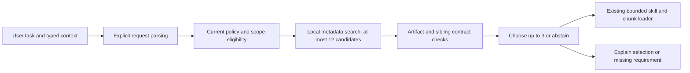

# PRD: Skill routing quality as the library grows

Status: **Isolated preview implemented; quality promotion HOLD; integrated acceptance incomplete.**
Date: 2026-09-13. Owner: Alex (product); shared memory/harness composition.
Baseline inspected: `5cf5835f78d8e779443188c3490172d7736a589a` plus the uncommitted
[dollar-token repair](foundation/dollar-skill-routing-repair.md).
[Research and execution record](foundation/skill-routing-quality-research.md).
[Implementation ledger](foundation/skill-routing-quality-implementation.md).
[Language follow-up](foundation/skill-routing-language-execution.md).

## 1. Objective

Select the right procedure for the current task as the installed catalog grows,
without requiring users to remember skill names, flooding model context, or
activating a similar skill with the wrong execution contract. Preserve useful
abstention: a conversation that needs no skill must remain a normal conversation.

User inspiration: Cloud Codes’ [Every Skill You Add Breaks Your Harness
(Here's the Fix)](https://www.youtube.com/watch?v=YnXl7bb3V0o). Its public
creator description and source list were retrieved; public captions returned an
empty response. This PRD does not claim a full audiovisual review.

### Library preservation — binding user requirement

Alex explicitly requires keeping the complete installed skill library. Routing
shortlists are temporary views for a task, not library cleanup. No routing,
indexing, migration, evaluation or rollout operation may delete, automatically
archive/disable, overwrite or rewrite existing skills, references or user edits.
Unselected skills remain available for later tasks and explicit invocation under
existing policy. Any authored descriptor changes to existing skills must be
separately requested; initial indexing may use existing metadata or derived,
disposable index records without mutating source files.

Verify source-file inventory and content hashes before/after indexing, routing,
cache rebuild, preview-mode switches and rollback. All must remain identical.
Catalog limits must be reported honestly; exceeding a bound must never trigger
file deletion or a claim that every installed skill was indexed.

### Task understanding is the primary product goal

The user describes the work in ordinary language; Vesper identifies the appropriate
skill automatically from the preserved library. Library reduction, fewer loaded
skills or faster lookup alone do not satisfy this objective. Selection must match
the requested action, artifact, constraints and available resources, including
paraphrases that never mention the skill name. Explicit invocation is an optional
control, not the normal requirement for correct routing.

Examples: “turn these figures into an Excel workbook” selects spreadsheet creation;
“review this migration without changing the database” selects a compatible review
procedure, not migration execution. Evaluate these using labeled acceptable skills
from the actual installed test catalog, not invented capabilities. Missing suitable
skills remain an honest no-match; a plausible name is not proof of suitability.

## 2. Source findings and their limits

| Source | Finding used here | Implication for Vesper |
| --- | --- | --- |
| [Skill Shadowing, v2](https://arxiv.org/abs/2605.24050v2) | In its evaluated expanding libraries, selection failure explained more degradation than context overhead. | Test selection and downstream task outcomes separately as distractors grow. These results are not Vesper measurements. |
| [SkillRouter, v5](https://arxiv.org/abs/2603.22455v5) | Bodies carry useful discriminating information; body-distilled descriptions recover some, but not all, of the gap in its benchmarks. | Improve authored routing descriptors first; compare embeddings experimentally. Do not promise descriptor equivalence to full-body routing. |
| [Right Family, Wrong Skill, v2](https://arxiv.org/abs/2606.10388v2) | Similar capabilities can differ in required resources, procedures or artifacts. Helpful retrieval and risky sibling exposure are separate metrics. | Test sibling pairs with different contracts, including role reversals. |
| [GitHub tool selection](https://github.blog/ai-and-ml/github-copilot/how-were-making-github-copilot-smarter-with-fewer-tools/) | GitHub describes embedding-guided routing, clustering and reducing its default tools from 40 to 13. | Shortlist candidates and reduce duplication; do not copy its tool count or infer equivalent skill results. |

The video's percentage and attention claims are not acceptance targets. No claim
that a given share of model attention equals a universal share of routing signal.

## 3. Inspected baseline and original gaps (5cf5835)

- `crates/vesper-memory/src/skill_orchestrator.rs` already owns shared deterministic
  eligibility, metadata scoring, conflicts, loading and outcome adjustments.
  `score_candidate` uses names, descriptions, tags, triggers, file types, token
  overlap and hashed cosine. This is not a learned semantic embedding model.
- `MAX_SELECTED_SKILLS = 3`, 24,000 characters per skill and 60,000 aggregate
  already constrain injection. This proposal does not introduce those features.
- `skills.rs` caps the catalog at 500 files and reads a 32,000-byte prefix.
  The 120-character `headline_of` is a display/fallback value: `parse_metadata`
  reads the frontmatter description from the prefix. Do not claim all routing
  descriptions are currently cut to 120 characters.
- `SkillRoutingQuery` has prompt, explicit skill, tools, platform and outcome
  adjustments; it has no typed task artifact, execution mode or task-phase field.
- Existing exclusions, risk, required tools and conflict gates help, but there is
  no explicit family/variant contract for choosing between similar workflows.
- Current scoring has a threshold but no calibrated decision-margin policy or
  comprehensive labeled abstention/large-distractor evaluation described here.
- The dollar-token fix addresses a separate parsing failure. A richer ranker must
  not reintroduce that failure or treat arbitrary quoted content as authorization.
- The inspected `rank_chunks` still admits `score > 0`. The separate
  [chunk score-floor PRD](chunk-score-floor-prd.md) owns its pending conjunction
  repair. Do not silently subsume it or report it complete.

## 4. Recommended architecture

### D1. Improve the information used for selection

Introduce optional, versioned routing descriptors alongside existing frontmatter:
`family`, `purpose`, `actions`, `use_when`, `avoid_when`, `inputs`, `outputs`, `preconditions`,
`effects`, and a small set of positive/negative task examples. Examples distinguish
nearby procedures; they must not be exact copies of evaluation prompts.

Proposed bounds: one descriptor <= 4,096 UTF-8 bytes, <= 8 entries per list,
<= 240 characters per entry, <= 3 positive and 3 negative examples. Invalid
present descriptors produce a diagnostic and disable enhanced automatic routing
for that entry; absence preserves legacy behavior. Never silently truncate fields.
Existing permission, risk and tool metadata remain authoritative; new descriptors
cannot lower their restrictions. Contradictory effects are a validation error.

Authors may summarize a skill's execution contract from its body during ordinary
skill development. At runtime only the validated metadata is ranked. Do not add
automatic unreviewed body ingestion or model-generated metadata to normal turns.
Descriptors must identify their skill content revision; stale descriptors are
excluded from enhanced routing until refreshed. Legacy metadata remains usable
when it passes the existing gates, with an explicit fallback reason.

### D2. Separate retrieval from activation

Compare the existing scorer against local field-weighted lexical retrieval
(BM25 candidate, no external service). Build a deterministic in-memory index of
validated descriptors and current metadata; select at most 12 candidates before
contract comparison. Include exact explicit requests directly, subject to policy.
Use stable IDs to resolve ties; never make filesystem iteration order significant.

Keep the 500-entry bound. This initiative is not authorization for an unbounded
registry. Index updates follow catalog revision changes, local-over-global
shadowing, deletion, archive and restore. Revalidate live policy and content
identity before loading; caches cannot resurrect deleted or newly forbidden skills.
No new durable state in ACP by default. A missing index falls back to the current
router; a fallback is observable and does not claim enhanced operation.

### D3. Distinguish siblings by the requested outcome

Carry typed, bounded task hints for requested artifact, read/write intent and
known resources from explicit user choices or host-validated task state. Unknown
values stay unknown. A model-inferred hint may influence relevance, but never
satisfy permission, resource availability or explicit activation requirements.

Examples: CSV analysis versus spreadsheet generation; database inspection versus
migration execution; drafting a release note versus publishing a release.
A positive topic match cannot override a known contradiction in the contract.
`family` helps compare variants; it is not a fixed one-skill-per-family limit,
because some tasks need complementary skills. Pairwise conflicts still apply.

### D4. Abstain honestly and recover without blocking ordinary prompts

Return structured outcomes: selected, no skill needed, ambiguous, missing
precondition, explicit request invalid, or fallback. Ranking scores are not
probabilities. Tune thresholds and score margins only on the development split.

Automatic uncertainty continues the ordinary agent turn with no forced skill.
Ask a concise question only if a missing user choice changes the requested action
or artifact materially. Do not ask on every low-confidence route. `/skill` remains
an explicit override of relevance, never of policy. Literal math, shell variables,
code fences and quoted instructions do not create explicit requests.

Permit one additional bounded search at a task transition when new user or
validated task information resolves ambiguity. It must not replay tool calls,
blindly reactivate compacted identities, or create an endless routing loop.

### D5. Make decisions inspectable

Propose Settings → Skills with per-project enable/disable and routing mode
`Standard` / `Enhanced (preview)`. Ordinary changes use the existing draft and
Save/Discard/Keep editing flow. Explicit disable applies to both routing modes;
no hidden edits to skill files. ACP exposes equivalent host-neutral controls.

Show a short activity message such as “Selected spreadsheet creation: requested
output is .xlsx.” Details expose matched fields, rejected sibling reason, fallback
and descriptor version. Logs retain IDs/reason codes by default, not full prompts,
skill bodies, local secrets or hidden reasoning. Screen-reader output is meaningful.

### D6. Optional embedding experiment, not a required dependency

Once the lexical baseline is measured, compare metadata/descriptor embeddings
with it behind a provider-neutral port. Record model/license/revision, dimensions,
normalization, resource requirements, latency and cache fingerprint. A deterministic
fixture port tests plumbing only; it is not retrieval-quality evidence.

Direct body-aware retrieval is deferred: it conflicts with ADR 0024's metadata-only
rule and the root contract. It requires a separate accepted contract/ADR change,
provenance review and isolated-skill privacy design before implementation. A paper
is not authorization to introduce body ranking, model downloads or external calls.
Enhanced lexical routing must remain fully usable without embeddings, a GPU or
another account. No automatic model installation or remote upload of skill content.

## 5. Requirements and acceptance matrix

All values below are proposed release gates, not achieved measurements.

| ID | Required behavior | Required evidence |
| --- | --- | --- |
| R1 | Typed explicit requests; literal dollar/math/code text preserved | Fail-before/pass-after parsing suite, known/unknown names, quoted requests, fences, escapes, Unicode; unchanged original submitted text |
| R2 | Bounded, revisioned descriptors; legacy compatibility | Malformed/oversized/stale cases, no silent truncation, exact fallback and local/global precedence tests |
| R3 | Deterministic shortlist with current eligibility | Reordering invariance; archived/disabled/tool/platform/permission cases; no excluded item loaded after cache invalidation |
| R4 | Artifact/precondition/effect discrimination | Same-family pairs and role-flip queries; no inferred permission grants |
| R5 | Correct activation and abstention | Separately labeled no-skill and skill-needed prompts; useful later shorthand; bounded recovery and no replay |
| R6 | Existing loading and chunk protections preserved | Three-skill and character budgets, isolated-body non-disclosure, D3/exemplar/cross-talk controls, completed score-floor regression when available |
| R7 | Both hosts receive the same routing decisions | TUI/ACP direct, VRO and supported ReAct path fixtures with identical inputs; restart and Settings controls |
| R8 | Explainable preview and reversible rollout | Default Standard behavior; Enhanced opt-in; Save/Discard tests; fallback reasons; no unexpected durable ACP writes |
| R9 | Measured improvement under distractors | Frozen held-out corpus and ablations described below; publish failures as well as wins |
| R10 | Bounded costs and optional embeddings | Local timing/memory/context receipts; embedding errors fall back; no provider calls in foundation verification |
| R11 | Preserve the entire installed library and user edits | Identical source inventories/hashes across indexing, routing, mode changes and rollback; unselected skills remain discoverable within declared catalog bounds; no automatic deletion/archive/disable |

## 6. Evaluation and promotion gates

PR-1 must freeze at least 240 labeled queries across at least 12 workflow families:
80 positive/single-skill (at least 60 natural-language paraphrases with no skill
name or exact trigger phrase), 40 no-skill, 40 same-family pairs, 40 explicit/literal
syntax cases and 40 multi-step/resource/policy cases. Include actual paraphrased
user failures without private content. Annotate acceptable skill sets, forbidden
siblings and whether invocation is needed; do not label by current router output.
Split 120 development / 120 held-out by task template; keep paired variants in
the same split. No tuning on the held-out set. Product owner reviews disputed labels.

Use fixed library snapshots at 25, 100, 250 and 500 entries, inserting the same
helpful targets while adding known irrelevant and near-duplicate distractors.
Record snapshot hashes, descriptors, query labels and ordering seeds. Run three
order permutations to detect order sensitivity. Synthetic distractors are marked
as such and do not establish real-world catalog coverage.

Report Hit@1, acceptable Recall@3, harmful-sibling exposure@3, false abstention on
skill-needed tasks, false activation on no-skill tasks, and eligible-set violations.
Report the no-name paraphrase subset separately and apply the positive-query
Recall@3 and false-abstention gates to it as well. Report per-family counts,
absolute deltas and uncertainty intervals; a small
corpus must not be presented as a universal performance guarantee.

Promotion requires on held-out queries at every library size:

- Zero policy violations, budget violations, false explicit errors on literal text
  and failures of existing contractual regressions.
- At least 95% acceptable Recall@3 and <= 5% false abstention on labeled positive
  queries; <= 2% false activation on labeled no-skill queries.
- Harmful-sibling exposure <= 2%, and no worse than baseline. Labels measure
  retrieved exposure separately from executed effects.
- At least five percentage points better Hit@1 on the sibling/paraphrase subset;
  no loss of more than two points in aggregate Recall@3 versus baseline. If the
  baseline leaves insufficient headroom, record HOLD and review the gate openly.
- On a recorded reference Linux CPU: warm p95 <= 50 ms for 500 entries, cold index
  build <= 2 seconds, index <= 32 MiB. Report hardware, ten warm-up runs and 100
  timed queries. Other platforms need their own measurements before parity claims.
- No full-catalog injection; existing body budgets unchanged. Measure actual added
  input tokens using the active estimator; reason messages <= 512 characters.

Ablations: baseline, richer descriptors with old scorer, new lexical retrieval,
contract filtering, and optional embeddings. Change one axis at a time. Keep
correct abstention distinct from abandonment; more skill invocations is not a
success metric. A deterministic routing win is not proof of better task completion.
Any downstream effectiveness claim needs separately authorized, cost-bounded agent
runs on identical tasks/providers with repeated trials and execution evidence.

If gates fail, retain Standard as default and publish HOLD with failed cases.
No weakened labels, removed hard negatives or hidden failed configurations.

## 7. Delivery sequence and ownership

1. **PR-1 — baseline and labels:** freeze current tree plus parser fix; record
   unfinished score-floor work as a dependency; build evaluation harness and
   catalog-health diagnostics. No ranker behavior changes.
2. **PR-2 — descriptors and index:** memory owns validated schema and pure lookup;
   seed authors may propose descriptions/examples under their own DOX chain,
   but existing user-library edits require separate authorization;
   composition owns indexing lifecycle. Existing routing remains default.
3. **PR-3 — selection:** memory owns contract comparison, abstention and traces;
   harness supplies validated context and bounded transition search. Finish the
   separate score-floor repair before integrated R6 acceptance.
4. **PR-4 — host controls:** domain owns common control/event shape; TUI and ACP
   wire preview configuration and diagnostics together. No parallel host rankers.
5. **PR-5 — evaluate and decide:** compare ablations; publish ADOPT/HOLD. Embeddings
   are an optional follow-up experiment and cannot hold basic lexical delivery
   hostage. Promotion requires all mandatory gates, not a model's assurance.

Implementation must read each owning DOX chain and run `cargo xtask verify`,
changed-crate Rust 1.88 checks, routing ablations and host acceptance. Before any
release, follow the existing exact-commit pipeline. Alex subsequently approved implementation with GLM score-floor coexistence.
No new release or replacement of Alex's installation is authorized by that approval.

## 8. Non-goals

No skill-library deletion, automatic archiving/disabling, source rewriting,
automatic tool pruning, provider-specific tool-search
API integration, full-body ranking, model training, or threshold changes to
unrelated rankers. No public claims of measured improvement before evaluation.

## Concurrent score-floor implementation

[Coexistence reconnaissance](foundation/skill-routing-coexistence-recon.md) owns
the inspected GLM PR-1 baseline and file-level collision map. Routing implementation
uses `/tmp/vesper-routing-quality` on `feat/skill-routing-quality`. Preserve GLM's
`rank_chunks`, exports, pin/control, G5 and D3 changes at integration. Standard
routing retains the skill-tier baseline; Enhanced is a separate opt-in mode.

## Implementation interpretation and current adoption boundary

The approved implementation adds optional bounded `actions` to distinguish a
requested operation from another procedure in the same family. Authored sidecars
are sibling `<slug>.routing.json` files; none are installed or generated into
Alex's library by this work. Source freshness uses the bounded catalog prefix,
file length and modification timestamp. It detects ordinary edits without reading
isolated bodies, and is explicitly not cryptographic full-body attestation.

The initial quality matrix failed promotion. Standard remains default; Enhanced
is a labeled preview. The [implementation report](foundation/skill-routing-quality-implementation.md)
retains measurements, deviations and unexecuted integration items. Passing software
checks does not replace the quality gates above or GLM's pending score-floor gate.
